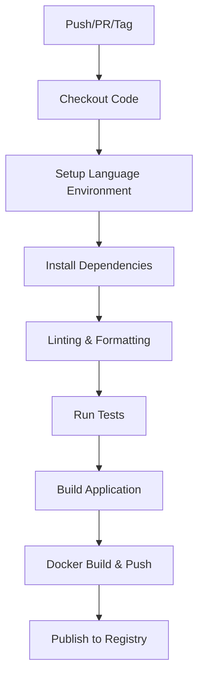

# GitHub Actions Workflows - Monorepo Multi-Lenguaje

Este documento describe los workflows de GitHub Actions implementados para las cinco aplicaciones del monorepo: Rust, Python, Node.js, Java (Spring Boot) y PHP.

## 🏗️ Estructura del Monorepo

El repositorio está organizado como un monorepo con workflows optimizados que solo se ejecutan cuando hay cambios relevantes:

```
.github/workflows/
├── monorepo.yml          # Coordinador general del monorepo
├── rust.yml              # CI/CD para applicacionRust/
├── python.yml            # CI/CD para aplicacionPython/
├── node.yml              # CI/CD para aplicacionNode/
├── java.yml              # CI/CD para aplicacionJava/
└── php.yml               # CI/CD para aplicacionPhp/
```

## ⚡ Optimizaciones del Monorepo

### 🎯 Ejecución Condicional
Los workflows usan `paths` filters para ejecutarse solo cuando hay cambios relevantes:

```yaml
on:
  push:
    paths:
      - 'aplicacionPython/**'
      - '.github/workflows/python.yml'
```

### 📊 Detección Inteligente de Cambios
El workflow principal (`monorepo.yml`) detecta automáticamente qué aplicaciones han cambiado usando `dorny/paths-filter`.

### 🚀 Paralelización
Workflows independientes se ejecutan en paralelo, optimizando el tiempo total de CI/CD.

## 📋 Resumen de Workflows

| Aplicación | Workflow | Características principales |
|-----------|----------|---------------------------|
| **Rust** | `rust.yml` | Cargo build, Clippy, fmt, Docker multi-stage |
| **Python** | `python.yml` | Flake8, Pylint, Black, pytest, Docker optimizado |
| **Node.js** | `node.yml` | Matrix build (18.x, 20.x), ESLint, Prettier, Docker |
| **Java (Spring Boot)** | `java.yml` | Maven build, SonarQube, Docker |

## 🔄 Flujo Común de CI/CD

Todos los workflows siguen este patrón:



## ⚙️ Configuración Común

### Secretos Requeridos (todos los workflows)

| Secreto | Descripción | Ejemplo |
|---------|-------------|---------|
| `DOCKERHUB_USERNAME` | Usuario de Docker Hub | `miusuario` |
| `DOCKERHUB_TOKEN` | Token de acceso | `dckr_pat_xyz...` |

### Variables Opcionales

| Variable | Descripción | Valor por defecto |
|----------|-------------|------------------|
| `MAJOR_VERSION` | Versión mayor | `1` |
| `MINOR_VERSION` | Versión menor | `0` |

### Triggers Comunes

- **Push** a rama `main`
- **Pull Requests** hacia `main`
- **Tags** con formato `v*`

## 🏗️ Características Específicas por Lenguaje

### 🦀 Rust (`applicacionRust/.github/workflows/rust.yml`)

**Herramientas específicas:**
- **Cargo** para build y gestión de dependencias
- **Clippy** para linting avanzado
- **rustfmt** para formato de código
- **Cache de Cargo** para optimización

**Imagen Docker:** `clima-app-rust:latest`

### 🐍 Python (`aplicacionPython/.github/workflows/python.yml`)

**Herramientas específicas:**
- **Flake8** para linting básico
- **Pylint** para análisis estático profundo
- **Black** para formato automático
- **pytest** para testing

**Imagen Docker:** `clima-app-python:latest`

### 🟢 Node.js (`aplicacionNode/.github/workflows/node.yml`)

**Características especiales:**
- **Matrix Strategy** (Node.js 18.x y 20.x)
- **ESLint** para linting JavaScript
- **Prettier** para formato de código
- **npm ci** para instalación reproducible

**Imagen Docker:** `clima-app-node:latest`

### ☕ Java (Spring Boot) (`aplicacionJava/.github/workflows/java.yml`)

**Herramientas específicas:**
- **Maven** para build y gestión de dependencias
- **JUnit 5** para testing
- **JaCoCo** para cobertura de código
- **Docker** para empaquetado

**Imagen Docker:** `clima-app-java:latest`

### 🐘 PHP (`aplicacionPhp/.github/workflows/php.yml`)

**Herramientas específicas:**
- **Composer** para gestión de dependencias
- **PHPUnit** para testing
- **PHPStan** para análisis estático
- **PHP-CS-Fixer** para formato de código
- **Docker** para empaquetado

**Imagen Docker:** `clima-app-php:latest`

## 📦 Estrategia de Versionado

Todos los workflows usan el mismo esquema:

```
{MAJOR_VERSION}.{MINOR_VERSION}.{GITHUB_RUN_NUMBER}
```

Ejemplo:
- Variables: `MAJOR_VERSION=1`, `MINOR_VERSION=2`
- Run number: `45`
- Resultado: `1.2.45`

## 🚀 Imágenes Docker Generadas

### Tags automáticos:
```bash
# Latest (siempre la más reciente)
usuario/clima-app-{language}:latest

# Versión específica
usuario/clima-app-{language}:1.0.45
```

### Optimizaciones incluidas:
- **Multi-stage builds** (Rust, Python)
- **Cache de GitHub Actions**
- **Usuarios no-root** para seguridad
- **Imágenes mínimas** (Alpine, slim)

## 🔧 Personalización Avanzada

### Añadir nuevos triggers

```yaml
on:
  push:
    branches: [ "main", "develop" ]
  pull_request:
    branches: [ "main" ]
  schedule:
    - cron: '0 0 * * 0'  # Semanal
  workflow_dispatch:  # Manual
```

### Configurar notificaciones

```yaml
- name: Notify on failure
  if: failure()
  uses: actions/slack@v1
  with:
    status: ${{ job.status }}
    webhook-url: ${{ secrets.SLACK_WEBHOOK }}
```

### Añadir análisis de seguridad

```yaml
- name: Run security scan
  uses: securecodewarrior/github-action-add-sarif@v1
  with:
    sarif-file: security-results.sarif
```

## 🐛 Troubleshooting Común

### ❌ Error: "Secretos no configurados"
**Solución:** Configura `DOCKERHUB_USERNAME` y `DOCKERHUB_TOKEN` en Settings > Secrets

### ❌ Error: "Docker push falló"
**Solución:** 
1. Verifica que el token de Docker Hub tenga permisos de escritura
2. Asegúrate de que el repositorio existe en Docker Hub

### ❌ Error: "Tests fallan"
**Solución:**
1. Ejecuta tests localmente
2. Verifica dependencias en archivos de configuración
3. Revisa variables de entorno necesarias

### ❌ Error: "Linting falló"
**Solución:**
1. Ejecuta herramientas de linting localmente
2. Usa autofix cuando esté disponible
3. Ajusta configuración de linting si es necesario

## 📊 Monitoreo y Métricas

### En cada workflow se verifica:

- ✅ **Compilación exitosa**
- ✅ **Tests pasan**
- ✅ **Linting sin errores**
- ✅ **Formato de código correcto**
- ✅ **Build de Docker exitoso**
- ✅ **Push a registry exitoso**

### Tiempo estimado por workflow:

| Workflow | Tiempo típico | Con cache |
|----------|--------------|-----------|
| Rust | 3-5 min | 1-2 min |
| Python | 2-3 min | 1 min |
| Node.js | 2-4 min | 1-2 min |
| Java | 3-6 min | 2-3 min |
| PHP | 2-4 min | 1-2 min |

## 🎯 Mejores Prácticas Implementadas

### Seguridad:
- ✅ Usuarios no-root en contenedores
- ✅ Secretos para credenciales sensibles
- ✅ Tokens con permisos mínimos

### Performance:
- ✅ Cache de dependencias
- ✅ Builds paralelos (Node.js matrix)
- ✅ Imágenes optimizadas

### Mantenibilidad:
- ✅ Versionado automático
- ✅ Documentación completa
- ✅ Configuración flexible

### Calidad:
- ✅ Múltiples herramientas de linting
- ✅ Tests automatizados
- ✅ Verificación de formato

## 📈 Próximos Pasos Recomendados

1. **Configurar notifications** (Slack, Email)
2. **Añadir análisis de cobertura** de tests
3. **Implementar deployment** a staging/production
4. **Configurar dependency updates** (Dependabot)
5. **Añadir security scanning** automático
